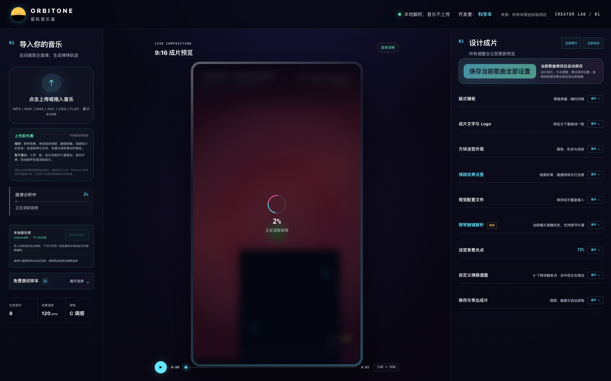
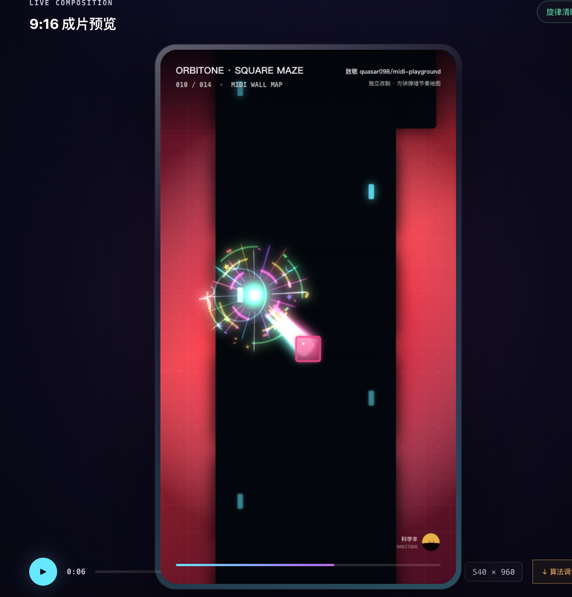
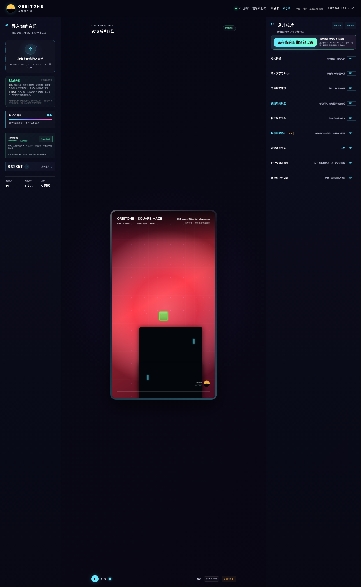

# ORBITONE 星轨音乐盒

把音乐变成 9:16 弹跳动画：在浏览器本地分析音频、校准节奏点，并用星轨、机械滚落或方块迷宫生成可录制的音乐可视化。

[在线轻量试玩](https://masir1128.github.io/MusicBox/) · [提交问题](https://github.com/Masir1128/MusicBox/issues)


> 音频、视频背景和歌曲配置均在浏览器本地处理。项目不会把用户导入的媒体上传到服务器。

> **在线版是轻量试玩，不是完整工作台。** 为保证公共静态站点在普通设备上也能流畅打开，在线版只提供 3 首原创样本、3 套核心动画和精简特效。音乐导入、算法调试、逐歌曲保存、视频背景与高清导出均保留在本仓库的本地完整版中。

## 完整版界面预览

<table>
  <tr>
    <td width="50%"></td>
    <td width="50%"></td>
  </tr>
  <tr>
    <td align="center">完整创作工作台与逐歌曲配置</td>
    <td align="center">方块迷宫、彩带拖尾与碰撞效果</td>
  </tr>
</table>



## 在线试玩与本地完整版

| 功能 | 在线轻量试玩 | 本地完整版 |
| --- | --- | --- |
| 原创样本与核心动画 | 3 首、3 套 | 11 首、3 套 |
| 自定义音乐导入与钢琴触键识别 | — | 支持 |
| 算法时间轴、人工补点、撤回与缩放 | — | 支持 |
| 每首歌独立保存全部配置 | — | 支持 |
| 图片 / 视频背景、完整拖尾与碰撞特效 | 精简效果 | 支持 |
| 单帧与离线 MP4 导出 | — | 支持 |

在线站点适合快速了解作品；要验证完整算法和创作流程，请按下方步骤在本地运行。

## 当前开源版本

`v2.0.0` 同步了 2026 年 10 月前的主要本地功能，包括三套动画模板、方块迷宫特效、逐歌曲配置、本地曲库、人工卡点编辑和本地视频背景。

开发者：**科学羊 / Masir1128**

## 主要功能

- 导入 MP3、WAV、M4A、AAC、OGG 或 FLAC，在浏览器本地完成分析。
- 钢琴频谱起音检测，并使用 Spotify Basic Pitch 做候选复核。
- 全曲调试时间轴：新增、移动、框选、删除、撤回和缩放卡点。
- 每个手工卡点都会同步生成弹跳砖块与碰撞效果。
- 星轨弹跳、机械悬浮和方块迷宫三套独立渲染模板。
- 彩带拖尾、碰撞光效、泛光、震屏、网格背景等可调参数。
- 每首歌独立保存动画、算法、谱面和视觉配置。
- IndexedDB 本地曲库，刷新后可恢复音频与编辑结果。
- 方块迷宫支持本地图片或视频背景；任意画幅自动居中裁切为 9:16。
- 视频背景静音循环并与歌曲时间同步，不替换歌曲音轨。
- 11 首原创、带精确谱面的测试音乐。
- 导出调试 JSON、可编辑谱面 JSON、单帧图片及离线 MP4。

## 本地运行

需要 Node.js `>=22.13.0`。

这是一个同时使用浏览器音频解码、Canvas 实时渲染、IndexedDB 和视频导出的复杂前端项目。完整测试建议使用最新版 Chrome 或 Safari，开启硬件加速，并在电脑本地运行；低性能设备可先关闭泛光、背景网格和高强度碰撞特效。

```bash
git clone https://github.com/Masir1128/MusicBox.git
cd MusicBox
npm install
npm run dev
```

生产构建与本地启动：

```bash
npm run build
npm start
```

代码检查与回归测试：

```bash
npm run lint
npm test
```

## 使用方式

1. 选择内置原创样本，或导入自己的音乐。
2. 在算法调试面板检查落点；需要时手工新增、移动或删除。
3. 选择星轨、机械悬浮或方块迷宫，并调整视觉参数。
4. 如需 MV/动画背景，在方块迷宫的“迷宫皮肤”中上传本地视频。
5. 点击“保存当前歌曲全部设置”，把音频、谱面、配置和视频背景绑定到当前歌曲。
6. 完成预览后导出单帧或 MP4。

## 本地数据说明

- 音频、歌曲配置和自定义视频存放在浏览器 IndexedDB 中。
- 本地数据与浏览器来源绑定；更换域名或端口、清理站点数据、使用隐私模式都可能导致数据消失。
- 大型视频会占用较多浏览器存储空间，能否保存取决于浏览器配额。
- 删除本地曲库项目不会删除电脑中的原始媒体文件。

## 音乐与版权

- 请仅导入自己创作、已获得授权或依法可以使用的音乐与视频。
- 仓库只包含项目原创生成的测试音乐和谱面。
- 第三方歌曲、MV、测试截图以及本地参考素材不会随源码发布。

## 项目结构

```text
app/                            页面、交互与样式
lib/melodyAnalyzer.ts           频谱起音分析
lib/pianoOnsetAnalyzer.ts       Basic Pitch 候选复核
lib/renderMusicBox.ts           渲染入口与模板路由
lib/renderKineticMusicBox.ts    机械悬浮渲染器
lib/renderSquareMazeMusicBox.ts 方块迷宫渲染器
lib/creatorSettings.ts          全局及逐歌曲本地配置
lib/localMusicLibrary.ts        IndexedDB 本地曲库
lib/offlineExport.ts            本地 MP4 导出
public/models/                  Basic Pitch 浏览器模型
public/samples/                 原创测试音乐与谱面
scripts/                        原创样本生成脚本
tests/                          构建与产品回归测试
```

## 已知边界

- 自动分析适合触键清楚、混响较少的钢琴或主旋律，不保证适配复杂齐奏与强混响录音。
- 浏览器支持的视频编码因系统不同而异；MP4/H.264 或 WebM 通常兼容性较好。
- 导出速度和特效流畅度受设备 GPU、视频分辨率及浏览器实现影响。

## 开源许可

本项目原创代码使用 [MIT License](LICENSE)。

项目使用 Spotify Basic Pitch 及其模型文件；相关内容采用 Apache License 2.0。详见 [THIRD_PARTY_NOTICES.md](THIRD_PARTY_NOTICES.md) 和 [licenses/Apache-2.0.txt](licenses/Apache-2.0.txt)。

## 致谢与开源参考

ORBITONE 的方块迷宫、MIDI 音符碰撞与弹跳动画的视觉方向，参考并致谢 GitHub 开发者 **[quasar098](https://github.com/quasar098)** 的开源项目 **[midi-playground](https://github.com/quasar098/midi-playground)**。

- 作者主页：https://github.com/quasar098
- 项目地址：https://github.com/quasar098/midi-playground
- 原项目许可：GPL-3.0
- 借鉴范围：方块弹跳、音符碰撞与 MIDI 可视化的整体视觉方向。
- 本仓库不分发该项目的歌曲、MIDI 文件或捆绑媒体；ORBITONE 当前公开的渲染器与程序化测试音乐由本项目独立维护。

## 贡献

欢迎提交 Issue 或 Pull Request。反馈踩点问题时，建议提供：

- 音乐类型和大致速度；
- 出问题的时间位置；
- 是“识别点不准”“漏点”，还是“动画显示不准”；
- 调试轨道截图或导出的调试 JSON；
- 浏览器与操作系统版本。

请不要在 Issue 中上传无权公开的完整音乐或 MV。
