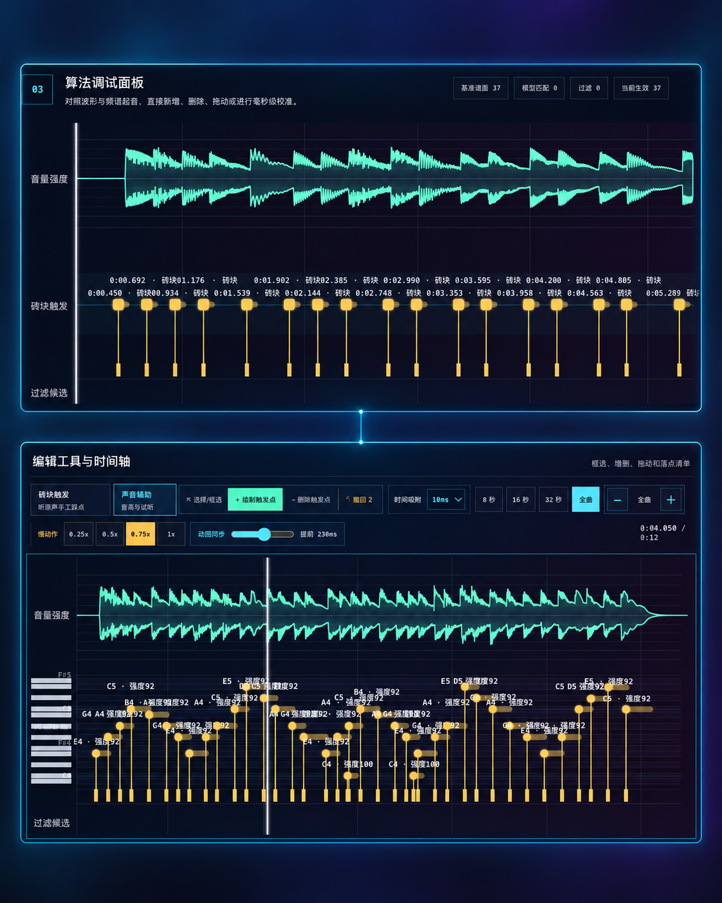
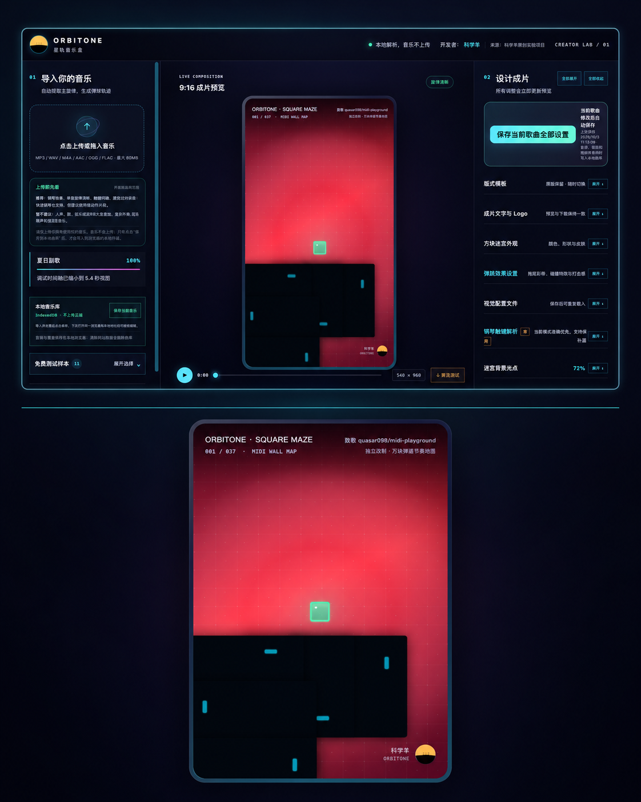
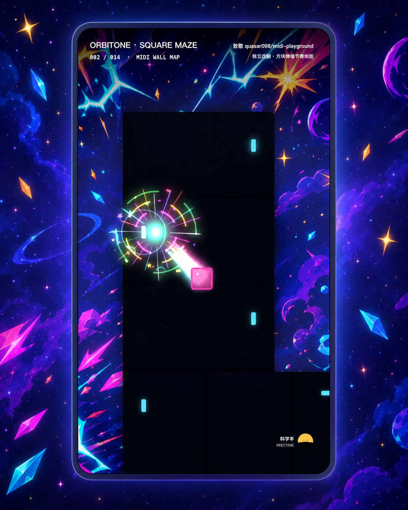

# ORBITONE 朋友圈发布素材

三张图片按发布顺序排列，分别展示音乐可编辑能力、赤红方块迷宫和星空方块迷宫。点击图片可查看原图。

## 01 · 音乐可以编辑

展示波形、砖块触发点、音符时间轴、增删落点、撤回、缩放与动画同步能力。

## 02 · 赤红方块迷宫

展示音乐导入、9:16 成片预览、逐歌曲保存和方块迷宫设置工作台。

## 03 · 星空方块迷宫

展示同一方块迷宫玩法可以切换为不同视觉皮肤和碰撞效果。
